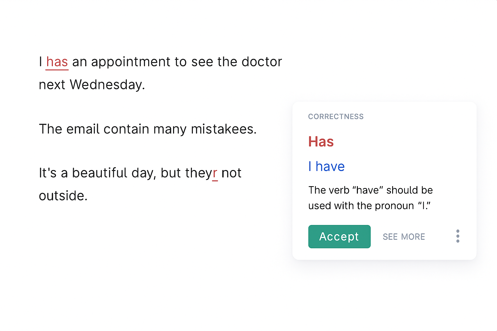
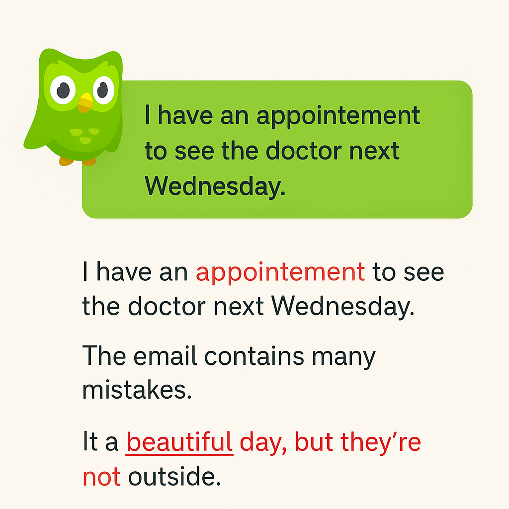
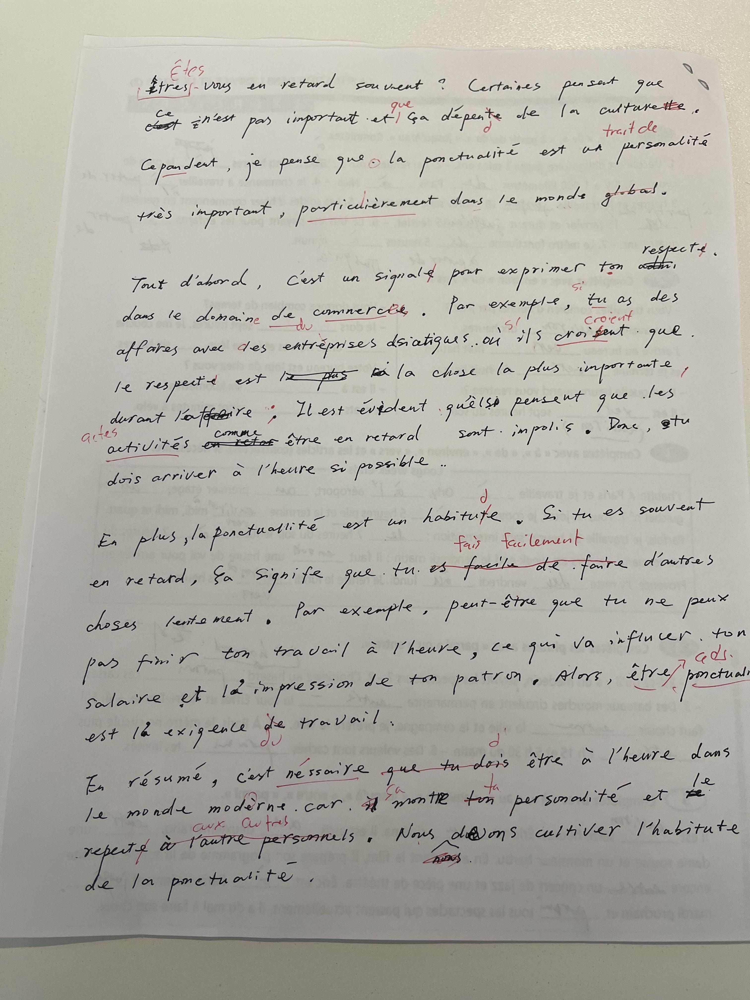
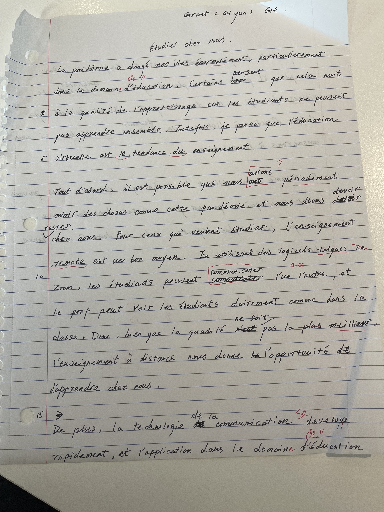
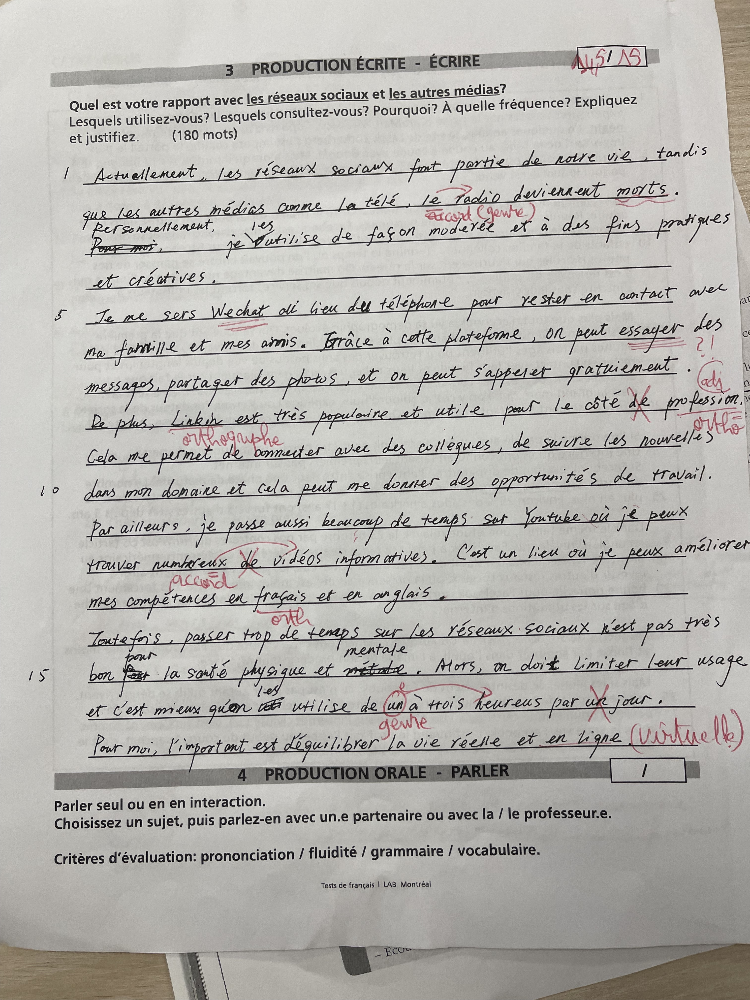
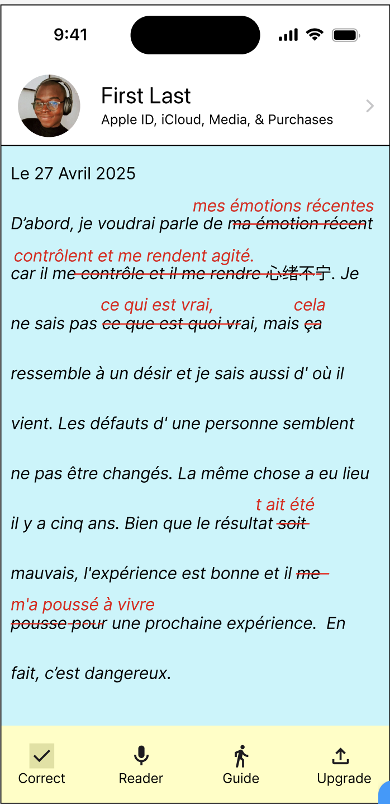

# Itération 1 – Préparation : Comprendre le contexte  

**Projet : LangSynapse – Système de correction et révision intelligente pour l’apprentissage des langues**  
**Équipe : Qiyun Ge & Yuping Yan**

---

## 1. Analyse du problème sur le terrain  

### Observation  

Les apprenants de langues, en particulier ceux qui étudient le français comme langue seconde, rencontrent souvent des difficultés à améliorer leur expression écrite.  
Les outils existants comme ChatGPT, Grammarly ou BonPatron proposent des corrections automatiques, mais sans offrir d’explications précises ni de véritable retour pédagogique.  
Les enseignants, quant à eux, manquent souvent de temps pour fournir des rétroactions personnalisées et détaillées.  

### Entretiens et retours préliminaires  

- **Étudiants** : souhaitent une aide grammaticale claire, interactive et explicative.  
- **Enseignants** : recherchent un outil qui conserve le style de l’étudiant plutôt que de réécrire entièrement les textes.  
- **Apprenants autonomes** : désirent un système capable de suivre et d’analyser leurs progrès linguistiques au fil du temps.  

### Documentation visuelle  
Des outils comme Grammarly ou Duolingo ont des fonctions pour corriger l’écriture, mais ce n’est pas utile pour moi.

|||
|:---:|:---:|
|||
|Image 1 – Grammarly : fonction de correction d’écriture|Image 2 – Duolingo : correction d’écriture|

J’aimerais que mes erreurs soient gardées pour pouvoir les comparer aux réponses correctes.

||||
|:--:|:--:|:--:|
|mon note1| mon note2|mon note3|

Elles sont bonnes, mais il y a encore deux problèmes :

1. Les enseignants ne peuvent pas corriger à temps.
2. Elles ne permettent pas d’enseigner efficacement pour l’avenir.

**Qant à moi, le produit parfait est comme ci-dessous.**

Image 3 – LangSynapse (Figma mockup)

---

## 2. Identification des enjeux  

### Enjeux sociaux  

Le projet LangSynapse vise à renforcer l’inclusion linguistique des étudiants et nouveaux arrivants au Québec.  
Il offre un accès équitable à un accompagnement linguistique personnalisé et soutient les enseignants dans la gestion de leurs corrections.  
L’objectif est de favoriser l’apprentissage actif et la compréhension des erreurs, plutôt qu’une simple dépendance à la correction automatique.  

### Enjeux écologiques  

L’utilisation d’une plateforme numérique permet de réduire la consommation de papier et d’encourager une approche d’apprentissage durable.  
Les échanges et les rétroactions se font en ligne, ce qui diminue l’empreinte carbone liée à la production, au transport et à l’archivage de documents physiques.  

### Enjeux logistiques  

Le développement du système doit garantir la protection des données linguistiques et la compatibilité avec les plateformes éducatives (Moodle, Google Classroom, etc.).  
L’expérience utilisateur doit être fluide et intuitive, même dans un environnement à connectivité limitée.  
La performance du modèle d’IA et la clarté des retours pédagogiques sont essentielles à la fiabilité du projet.  

---

## 3. Recherche de données chiffrées et études similaires  

- Selon l’OCDE (2023), plus de **37 %** des étudiants allophones déclarent manquer d’outils d’autoévaluation linguistique efficaces.  
- Grammarly (2022) compte environ 30 millions d’utilisateurs actifs, mais moins de **15 %** affirment comprendre les règles de grammaire derrière les corrections.  
- Une étude de l’Université Laval (2021) montre que l’apprentissage par **correction participative** améliore la rétention grammaticale de **42 %**.  

Ces données démontrent la pertinence de LangSynapse : un outil interactif qui met l’accent sur la compréhension et la participation de l’apprenant.  

---

## 4. Identification des utilisateurs  

| Catégorie d’utilisateur | Besoins principaux | Exemples |
|--------------------------|--------------------|-----------|
| **Étudiants en FLS/FLE** | Recevoir des explications claires et suivre leurs progrès | Étudiants à LaSalle College, Université de Montréal |
| **Enseignants de langues** | Déléguer les corrections répétitives tout en gardant le contrôle pédagogique | Professeurs de français langue seconde |
| **Apprenants autonomes** | Travailler leur écriture sans encadrement formel | Personnes préparant le TCF/TEF |
| **Chercheurs en IA linguistique** | Étudier la dynamique des erreurs et les processus d’apprentissage | Chercheurs et développeurs en NLP |

---

## 5. Conclusion de l’itération 1  

Cette première phase de préparation a permis de définir le contexte du projet LangSynapse, de préciser les besoins des utilisateurs et d’identifier les principaux enjeux sociaux, écologiques et techniques.  
Les prochaines étapes consisteront à prototyper la fonction de correction interactive et à planifier l’évaluation auprès d’un petit groupe d’utilisateurs test.
